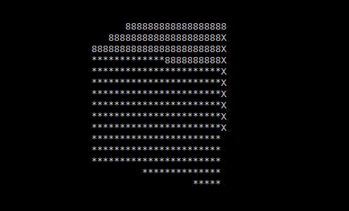

[Повернутись](../index.md)
# [](#header-1)Assignment #6. Trees
В цій лабораторній роботі ви маєте працювати в бригадах по 3 людини. Лабораторна робота, що була написана без використання git, не приймається. Один комміт "lab is done" не вважається використанням git. Враховуючи розмір та складність завдання, очевидно, що кожен учасник бригади має зробити щонайменше кілька комітів у репозиторій.

## Загальне завдання
* Розібратись в загальному і структурою даних "дерево" — де використовується, яому так називається.
* Розібрати всі запропоновані варіанти - виконувати потрібно тільки одне (за варіантом), але теоретичні питання будуть стосуватись всіх завданнь.
* Уважно розібратись з алгоритмічної складністю роботи з деревами (а точніше — звідки там так часто береться логарифм)

## [](#header-2)Варіант #0. Рендеринг зображення метод трасування променів
Написати програму, що приймає на вхід файл формату wavefront obj, а на виході створює зображення формату bmp або будь-якого іншого поширеного формату з візуалізацією моделі, яка знаходиться у вхідному файлі.

*В цьому варіанті дозволяється використовувти 3rd party бібліотеки для читання файлів \*.obj та для запису файлів із зображенням. Вочевидь, для запису зображення ви можете скористатися кодом, що написали самі або ваші одногрупники в попередній лабораторній роботі.*

### Опис методу трасування променів
Метод трасування променів полягає в наступному. Геометрія, яку треба візуалізувати, задається у вигляді набору трикутників у 3d просторі. Камера, що "знімає" сцену, задається точкою в просторі та вектором напряму зйомки. Перед камерою на невеликій відстані розташований уявний екран, що розділений на пікселі, кожен з якиї відповідає пікселю у вихідному зображенні. Із камери в бік сцени запускаються промені, кожен з яких проходить через піксель на уявному екрані. Для кожного з цих променів програма обчислює, чи перетинає він будь-який з трикутників, що розташовані на сцені. Якщо таких трикутників немає, то піксель фарбується в колір фону (чорний, наприклад). В інакшому випадку піксель фарбується іншим кольором. В найпростішому випадку — будь-яким відмінним від кольору фону. При цьому можуть враховуватися колір об\'єкта, кут падіння променя, затінення, глобальне освітлення і т.д. В цьому варіанті ви можете використати [flat shading](https://en.wikipedia.org/wiki/Shading#Flat_shading) або будь-яку складнішу модель затінення.


*Зображення взяті з сайту www.scratchapixel.com*

Оскільки кількість трикутників може бути значною (зазвичай набагато більше за 1 млн), а швидкість найпростішого алгоритму складає O(n*m), де n — кількість трикутників, а m — кількість пікселів зображення, використовують структури даних схожі на дерева, що дозволяють швидко відсікати трикутники, які точно не перетинаються з променем під час трасування.

В даному варіанті ви маєте використати структуру octree (або KD-tree чи R-tree, що складніше) для оптимізації швидкості роботи трасування.

*Більш складний варіант (+1 бал):* додати трасування тіней або заломлення/віддзеркалення променів.

### Приклад
Оскільки трасування променів доволі незрозуміла для багатьох тема, за [цим посиланням](https://repl.it/@L4fter/SpottedEnragedShell) ви можете знайти реалізацію саме трасування, результат якої виводиться в консоль.

Додавши затінення flat shading, освітлення та рух камери можна створити програму, що виводить в консоль зображення



### Посилання
* [Статті про трасування](https://www.scratchapixel.com/lessons/3d-basic-rendering/introduction-to-ray-tracing/implementing-the-raytracing-algorithm), в яких дуже докладно описується, яким чином виконати цю лабораторну роботу, проте без використання дерев.
* [Формат obj](https://uk.wikipedia.org/wiki/Obj). Для цієї роботи треба вміти читати лише список вершин (v) та список граней (f), всі інші поля можна ігнорувати. Можливо, доречними будуть і нормалі.
* [Рендеринг](https://uk.wikipedia.org/wiki/%D0%A0%D0%B5%D0%BD%D0%B4%D0%B5%D1%80%D0%B8%D0%BD%D0%B3).
* [Octree](https://en.wikipedia.org/wiki/Octree).
* [KD-tree, R-tree](https://fat-crocodile.livejournal.com/156564.html).
* [Файли obj](https://github.com/coboshm/OpenGL-Samples/tree/master/Model) серед прикладів OpenGL.

## [](#header-2)Варіант #1. Побудова математичного інтерпретатора
Написати програму-інтерпретатор математичних виразів, що підтримує змінні та оптимізацію виразів. Можете взяти за основу вашу або чиюсь попередню лабораторну роботу із Shunting Yard.

В цій роботі замість того, щоб одразу обчислювати значення кожної операції, необхідно спочатку побудувати абстратне синтаксичне дерево виразу. Далі завдання полягає в його оптимізації, наприклад заміні частини дерева, що обчислює ```a = (p + 3*d - 2^3) * 0;``` замінити на ```a = 0;```. Значення змінних найкраще зберігати в хеш-таблиці. Ніякі типи даних, крім чисел із плаваючою комою, впроваджувати не обов\'язково.

Коли дерево повністю побудоване, обчислити значення виразів легко — необхідно пройти по дереву алгоритмом depth-first, обчислюючи проміжний результат в кожній вершині.

AST використовують щоразу при компіляції програм написаних практично всіма мовами програмування. Наприклад, наступному фрагментові коду (приклад з вікіпедії)
```
while b ≠ 0
  if a > b
    a := a − b
  else
    b := b − a
return a
```
може відповідати таке дерево:


### Вхідні та вихідні дані
На вхід програмі подається текстовий файл з кодом, наприклад:
```
abc = 1;
q = 3;
2+abc*q;
```
Програма має вивести результат обчислення останнього виразу на екран:
```result = 5.0```

Синтаксис вашої мови можете вибрати будь-який. Програма має підтримувати змінні з іменем довжиною в будь-яку кількість символів, наприклад "a", "abc", "getthereveryfastindeed".

*Складніший варіант (+1 бал):* додати оператор if. Щоб не додавати булеві типи даних, можна вважати за true будь-яке відмінне від 0 число з плаваючою комою. Синтаксис оператора довільний (з дужками, без дужок, з endif, з блоками { }, або відступами, як у python)

## [](#header-2)Варіант #2. Пошук найближчих установ до заданої географічної точки.
Написати програму, що за вказаними координатами та радіусом виводить список всіх установи, що знаходять всередині кола/квадрата із центром у заданих координатах та заданим радіусом.

Майже будь-якій програмі (застосунку, сервісу) сьогодні доводиться мати справу з  даними. Сервіси зберігають інформацію про своїх користувачів (ім'я\логін), їх дії (замовлення, особисті кабінети), купу аналітичних даних (що клікнув користувач, як довго знаходився на певній сторінці, як часто заходить у сервіс). Цих даних накопичується так багато, що обробляти та аналізувати їх вручну стає дуже важко. Виникла ціла галузь комп'ютерних наук - Data Science, термін Bid Data та багато чого іншого цікавого, з чим ви ще обов'язково познайомитесь далі.

В цій же роботі вам пропонується більш просте завдання — написати структуру  для ефективної обробки певних даних. Очевидно, що якщо зберігати дані (скажімо, інформацію про користувачів) невпорядковано, то навіть при порівняно невеликій базі в мільйон записів кожна операція — спроба щось знайти буде потребувати повного перебору абсолютно всіх записів, що буде займати багато ресурсів — як процесорних, так і часових.

Будь-яка сучасна база даних підтримує індексування — створення допоміжної структури даних, що дозволяє набагато швидше виконувати певнії дії над даними. Наприклад, якщо побудувати навіть найпростіше бінарне дерево пошуку, то запит "знайти користувача віком 32 роки" буде виконуватись вже за логаріфмичний час. Префіксне дерево в свою чергу дозволить виконувати подібні запити на полях що є рядками (наприклад, ім'я). Сьогоді в базах даних дуже часто біля одного набору даних знаходиться декілька індексів,що дозволяють робити ефективні запити на різних полях.

Індекси можна будувати не тільки над рядками та числами, але й над більш цікавими даними - наприклад над географічними точками. Для цього є навіть окрема назва — Spatial index. Найчастіше,  такий індекс реалізовується за допомогою спеціальних дерев, що називаються [R-Tree](https://en.wikipedia.org/wiki/R-tree)

### Вхідні та вихідні дані

Вам дається файл наступного формату (csv) [лінк](examples_7/ukraine_poi.csv)

```
Широта; Довгота; Тип; Підтип; Назва; Адреса;
```
Ці дані взяті з відкритих джерел — із Open Street Map. Для вашої зручності дані були попередньо оброблені у такий зручний формат із оригінального формату .osm. Ваше завдання - написати програму, що буде приймати на вході географічну точку (широта, довгота), ціле число  N, та тип/підтип шуканого об\'єкта. Програма має вивести на еркан всі установи, що потрапляють у квадрат довжиною N кілометрів із центром в заданій точці. Очевидний варіант — перебирати всі точки та перевіряти, чи потрапляє вона в потрібний сектор. Але це дуже неефективно, і суть завдання полягає саме у роботі зі структурою даних.

```
> rtree.exe --db=data.csv --lat=30.212, --long=35.872 --size=20
We found next entities in the sector:
1.
2...
```

*Більше складне завдання (+1 бал):* вводити не довжину сторони квадрату, а радіус кола

Також пам'ятайте, що координати  певної точки на планеті - це широта та довгота, при чому відстань у один градус між двома точками на екваторі набагато більше, ніж відстань у один градус близкьо до полюсів. Це треба враховувати і корректно рахувати відстані.  Для кращого розуміння потрібно почитати про [Проекцію Меркатора](https://en.wikipedia.org/wiki/Mercator_projection) та пограти у відому [гру від Гугла](https://bramus.github.io/mercator-puzzle-redux/), що показує як ця проекція викривлює справжні масштаби

### Посилання
* [Простою мовою про R-дерева](https://fat-crocodile.livejournal.com/156564.html)
* Цікавий вид R-дерев - [дерево Гільберта](https://en.wikipedia.org/wiki/Hilbert_R-tree)
