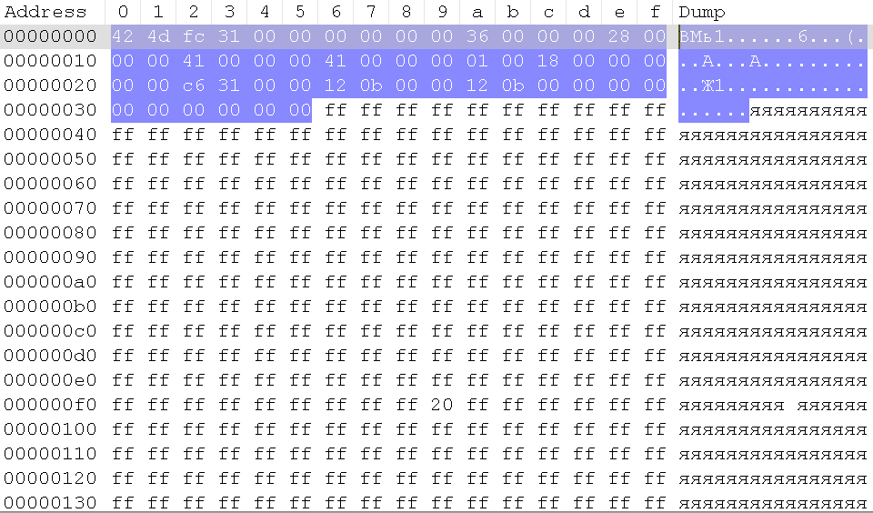

[Повернутись](../index.md)
# [](#header-1)Assignment #4. Binary files. OOP.

Варіант завдання – остача від ділення номеру бригади на 3. Варіантами можна _обмінюватись_, але не можна просто змінювати за власним бажанням. Будь ласка, перед виконанням заповніть [цю таблицю](https://docs.google.com/spreadsheets/d/1gXwSgYSGhvlDDNyUX3XfDecRc0SiDouf8GOyUXTqicg/edit#gid=334946938). Вимоги до використання git такі самі, як і в попередніх [роботах](./assignment_2.md). Також уважно ознайомтесь з загальними правилами здачі лабораторних та принципами оцінювання. 

У цій роботі, на відміну від попередньої, ви *можете* використовувати будь-які структури даних на ваш вибір: власноруч написані, присутні в стандартній бібліотеці С++/інших мов чи third party бібліотеки. Використовувати будь-які засоби, в яких імплементується логіка, необхідна для виконання роботи все ще *не можна* (наприклад, бібліотеки для роботи із зображеннями, аудіо чи архівами).

Якщо з вашимим бінарними файлами щось пішло не так, і їх не відкриває переглядач зображень або ваша ж власна програма, можете переглядати їх в "шістнадцятковому" редакторі, наприклад:
* [HxD](https://mh-nexus.de/en/hxd/)
* [Visual Studio](http://stackoverflow.com/questions/1724586/can-i-hex-edit-a-file-in-visual-studio), ага
* [Notepad++](https://notepad-plus-plus.org/) з плагіном HEX-Editor

## Питання та необхідні знання
Третя робота має на меті познайомити вас із роботою з бінарними файлами та з основами об'єктно орієнтованого програмування. Використання ООП є обов'язковою умовою для здачі лабораторної роботи.

Серед інформації, у якій слід розібратися:
* Endianess; little- та big-endian порядок байтів
* Принципи ООП. Навіщо використовуються об\'єкти і класи. Спойлер: "тому що ми звикли сприймати і працювати з об\'єктами в реальному світі" – зовсім неправильна відповідь
* Single Responsibility Principle

Ваша програма має бути доцільним чином розділена на класи, кожен з яких (якнайбільше) відповідає SRP

## [](#header-2)Варіант #0. Архіви

Завдання полягає в розробці простого архіватора. На вхід програми через параметри командного рядка подається ім'я вхідного та вихідного файлів та параметр, який вказує, що треба зробити – спакувати чи розпакувати вхідний файл. Алгоритм можете вибрати довільний, кілька алгоритмів є у посиланнях нижче. Наприклад, ви можете замінювати байти, що повторюються, на коротше представлення (run length encoding).

*Складніше завдання (+1 бал):* Створювати архів з кількох файлів АБО використати алгоритм стиснення Lempel—Ziv. Підійде будь-яка з версій алгоритму на ваш вибір.

### Вхідні та вихідні дані
Для стискування на вхід подається один або кілька файлів у довільному форматі (ви не знаєте наперед, які файли стискатиме користувач), на виході отримуємо архів. Наприклад, якщо ваша програма компілюється в megazip.exe:
```
> megazip.exe --compress output.mgzip input.bmp
Compressing file input.bmp... Done.
Result written to output.mgzip

// Або якщо підтримується кілька файлів
> megazip.exe --compress output.mgzip input1.bmp input2.bmp input3.bmp
Compressing file input1.bmp... Done.
Compressing file input2.bmp... Done.
Compressing file input3.bmp... Done.
Result written to output.mgzip
```

Для розпаковування на вхід подається ім\'я вхідного файла. Ім\'я вихідних файлів зазвичай збережене всередині архіву.
```
> megazip.exe --decompress output.mgzip
Getting out file input1.bmp... Done.
Getting out file input2.bmp... Done.
Getting out file input3.bmp... Done.
3 files written.
```

### Посилання
* [Стиснення файлів](https://en.wikipedia.org/wiki/Lossless_compression)
* [Run length encoding](https://en.wikipedia.org/wiki/Run-length_encoding)
* [Lempel—Ziv](http://math.mit.edu/~goemans/18310S15/lempel-ziv-notes.pdf) (1 частина документа). Підійде будь-яка з версій алгоритму на ваш вибір.

## [](#header-2)Варіант #1. Обробка зображень
Завдання полягає в збільшенні зображення в задану цілу кількість разів. На вхід програмі подаються імена вхідного та вихідного файлів, а також число. Ваша програма має працювати з форматом BMP. Для збільшення зображення не обов\'язково використовувати складні алгоритми – достатньо лише кілька разів копіювати пікселі.

*Складніше завдання (+1 бал):* Збільшувати та зменшувати зображення в нецілу кількість разів, використовуючи інтерполяцію

### Формат файлів BMP
Програма має працювати з bmp файлами, які зберігають колір у форматі 24 бітів на піксель. 

*Типи intX_t використовуються для представлення цілих чисел з незалежним від розрядності ОС розміром. На свій страх і ризик ви можете використовувати типи відповідного розміру char, int, short, long, byte, які насправді залежать від розрядності вашої ОС та опцій компіляції.*

Файл починається із заголовка, який можна представити у вигляді C-структури
```C
typedef struct {
     int8_t id[2];            // Завжди дві літери 'B' і 'M'
->   int32_t filesize;        // Розмір файла в байтах
     int16_t reserved[2];     // 0, 0
     int32_t headersize;      // 54L для 24-бітних зображень
     int32_t infoSize;        // 40L для 24-бітних зображень
->   int32_t width;           // ширина зображення в пікселях
->   int32_t depth;           // висота зображення в пікселях
     int16_t biPlanes;        // 1 (для 24-бітних зображень)
     int16_t bits;            // 24 (для 24-бітних зображень)
     int32_t biCompression;   // 0L
     int32_t biSizeImage;     // Можна поставити в 0L для зображень без компрессії (наш варіант)
     int32_t biXPelsPerMeter; // Рекомендована кількість пікселів на метр, можна 0L
     int32_t biYPelsPerMeter; // Те саме, по висоті
     int32_t biClrUsed;       // Для індексованих зображень, можна поставити 0L
     int32_t biClrImportant;  // Те саме
     } BMPHEAD;
```
Скоріше за все вам знадобляться лише поля, позначені стрілкою. Далі йде інформація про пікселі у вигляді масиву з таких структур:
```C
typedef struct {
     int8_t redComponent;
     int8_t greenComponent;
     int8_t blueComponent;
} PIXELDATA;
```
Через неймовірну винахідливість авторів формату розмір у байтах кожного рядка пікселів має ділитися на 4. Тому якщо кількість пікселів у рядку помножена на 3 (розмір PIXELDATA) не ділиться на 4, необхідно дописувати ще кілька нульових байтів у кінець кожного рядка. Докладніше про те, як це зробити, можете прочитати [тут](https://www.siggraph.org/education/materials/HyperVis/asp_data/compimag/bmpfile.htm)

### Вхідні та вихідні дані
Припустимо, що ваша програма компілюється в resize.exe. Тоді її треба запускати наступним чином:
```
> resize.exe input.bmp output.bmp 3
Enlarging image 3 times... Done.
Written result to output.bmp
```
Приклад [вхідного](./examples_4/bmp.bmp) та [вихідного](./examples_3/bmp5x.bmp) зображень, а також дамп початкових байтів першого зображення у hex-редакторі *(заголовки позначені виділенням)*: 

### Посилання
* [RGB](https://en.wikipedia.org/wiki/RGB_color_model#Numeric_representations)-кодування
* [Формат BMP](https://en.wikipedia.org/wiki/BMP_file_format) на вікі
* [Докладний](http://www.digicamsoft.com/bmp/bmp.html) опис формату
* [Ще один](http://www.dragonwins.com/domains/getteched/bmp/bmpfileformat.htm) простий опис
* [Схоже завдання](http://docs.cs50.net/problems/whodunit/whodunit.html) на cs50, із ну дуже простим поясненням формату
* [Білінійна інтерполяція](https://en.wikipedia.org/wiki/Bilinear_interpolation), в статті також йдеться про інші види інтерполяцій. Ви можете використати будь-яку з них, проте для зображень підходять лише 2-вимірні, наприклад бікубічна. У програмах обробки зображень, наприклад, Photoshop, використовується також [фільтр Ланцоша](https://en.wikipedia.org/wiki/Lanczos_resampling).

## [](#header-2)Варіант #2. Обробка аудіо
Завдання полягає в розробці програми, що буде збільшувати тривалість аудіофайла в задану кількість разів. Програма має працювати з файлами формату WAVE (зазвичай з розширенням \*.wav). Так само, як і у варіанті 1, не обов\'язково використовувати інтерполяцію, достатньо буде лише копіювати семпли.

*Складніше завдання (+1 бал):* Збільшувати чи зменшувати тривалість в нецілу кількість разів. В такому випадку вам доведеться використовувати інтерполяцію.

### Формат файлів WAVE
Програма має працювати із файлами формату wave із щонайменше будь-якою однією частотою дискретизації, наприклад 44100 Гц, і будь-яким одним бітрейтом, наприклад 128 кбіт/с, на ваш власний вибір. Файл wave складається із розділів і підрозділів *(chunks and subchunks)*. 

*Типи intX_t використовуються для представлення цілих чисел з незалежним від розрядності ОС розміром. На свій страх і ризик ви можете використовувати типи відповідного розміру char, int, short, long, byte, які насправді залежать від розрядності вашої ОС та опцій компіляції.*

Спочатку файл містить заголовок формату RIFF. Дані в ньому вказують, що міститься в цьому файлі
```C
typedef struct {
    int32_t chunkId;   // Завжди містить значення 0x52494646 (літери "RIFF")
    int32_t chunkSize; // 36 + розмір другого підрозділу в байтах
                       // Іншими словами 4 + (8 + SubChunk1Size) + (8 + SubChunk2Size)
                       // Це розмір всього файла мінус 8 байтів які займають поля chunkId та chunkSize
    int32_t format;    // Для wav-файла це завжди 0x57415645 (літери "WAVE")
} RIFFHEADER;
```
Перший підрозділ – заголовок WAVE. В ньому міститься інформація про спосіб зберігання файла (частота дискретизації, кількість каналів, бітрейт)
```C
typedef struct {
    int32_t subchunk1Id;   // Завжди 0x666d7420 – літери "fmt "
    int32_t subchunk1Size; // Завжди 16 для аудіо PCM. Це розмір частини підрозділу, що слідує після цього числа
    int32_t audioFormat;   // PCM = 1
    int16_t numChannels;   // Mono = 1, Stereo = 2
    int32_t sampleRate;    // Наприклад 44100
    int32_t byteRate;      // == SampleRate * NumChannels * BitsPerSample/8
    int32_t blockAlign;    // == NumChannels * BitsPerSample/8
    int16_t bitsPerSample; // 8 bits = 8, 16 bits = 16, etc.
} SUBCHUNK1;
```
Другий підрозділ – власне аудіодані
```C
typedef struct {
    int32_t subchunk2Id;   // 0x64617461 – літери "data"
    int32_t subchunk2Size; // == NumSamples * NumChannels * BitsPerSample/8, кількість байтів аудіоданих
    int8_t[] data;         // семпли
} SUBCHUNK2;
```

### Вхідні та вихідні дані
Припустимо, що ваша програма компілюється в resize.exe. Тоді її треба запускати наступним чином:
```
> resize.exe input.wav output.wav 2
Scaling sound file... Done.
Written result to output.wav
```
Приклад [вхідного](./examples_3/input.wav) та [вихідного](./examples_3/output.wav) аудіофайлів, а також дамп початкових байтів першого аудіо у hex-редакторі *(заголовки позначені виділенням)*: 

### Посилання
* [Формат WAVE](http://soundfile.sapp.org/doc/WaveFormat/)
* Вам може знадобитися аудіо-редактор [Audacity](https://sourceforge.net/projects/audacity/) або схожий інструмент
* [Лінійна інтерполяція](https://en.wikipedia.org/wiki/Linear_interpolation), в статті також йдеться про інші види інтерполяцій. Ви можете використати будь-яку з них, проте не всі підходять для звуку, лише одновимірні, наприклад кубічна.
